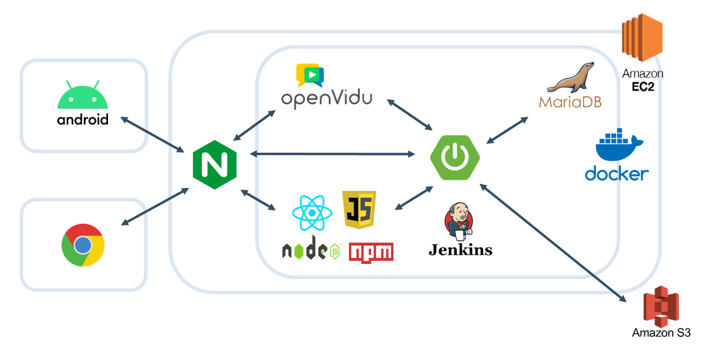
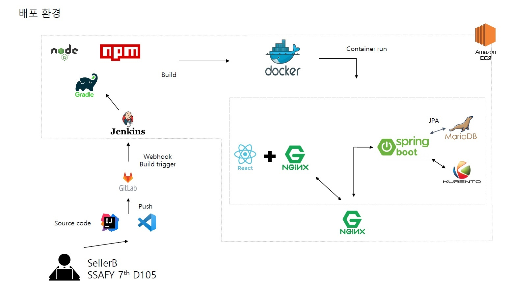

   
  
   
  <h1>비대면 제품 상담 서비스 SellerB</h1>
   

## :pushpin: 목차

1. [팀원 소개](#1)
2. [서비스 소개](#2)
3. [기술 스택](#3)
4. [시스템 아키텍처](#4)
5. [주요 기능](#5)
6. [프로젝트 기간](#6)
7. [프로젝트 산출물](#7)

## :sparkling_heart: 팀원 소개

<table>
    <tr>
        <td height="140px" align="center"> <a href="https://github.com/MilanoBeer">
                신혜연  (Front-End) </a>  </td>
        <td height="140px" align="center"> <a href="https://github.com/dlacogus5239">
                임채현  (Front-End) </a>  </td>
        <td height="140px" align="center"> <a href="https://github.com/henginthere">
                배혜연  (Back-End) </a>  </td>
        <td height="140px" align="center"> <a href="https://github.com/ljhyung">
                이주형  (Back-End) </a>  </td>
        <td height="140px" align="center"> <a href="https://github.com/GideokLee">
                이기덕  (AOS) </a>  </td>
    </tr>
    <tr>
        <td align="center">UI/UX
        <td align="center">UI/UX
        <td align="center">REST API
        <td align="center">REST API
        <td align="center">Android
    </tr>
</table>

## :bulb: 서비스 소개

### SellerB는 비대면 화상 일대일 전자제품 맞춤 상담 서비스입니다.

- 고객은 QR코드 스캔으로 해당 제품 상담을 신청할 수 있습니다.
- 매장 내 직원이 모두 상담중이어도 차례를 기다리지 않아도 됩니다.
- 상담원은 어디서나 상담이 가능하기에 하나의 매장에 소속되지 않아도 됩니다.
- 대면 상담이 부담스러운 고객은 바로 QR코드 스캔을 하여 비대면 상담을 할 수 있습니다.

### :clapper: SellerB 소개 영상

## :hammer: 기술 스택

 
<h3>기술 스택</h3>

 

  <table border="1">
<thead>
  <tr>
    <th>구분</th>
    <th>기술 스택</th>
    <th>상세 내용</th>
    <th>버전</th>
  </tr>
</thead>
<tbody>
  <tr>
    <td>공통</td>
    <td>형상관리</td>
    <td>Gitlab</td>
    <td>-</td>
  </tr>
  <tr>
    <td></td>
    <td>이슈관리</td>
    <td>Jira</td>
    <td>-</td>
  </tr>
  <tr>
    <td></td>
    <td>커뮤니케이션</td>
    <td>Mattermost, Notion</td>
    <td>-</td>
  </tr>
  <tr>
    <td>BackEnd</td>
    <td>DB</td>
    <td>MariaDB</td>
    <td>10.8.3</td>
  </tr>
  <tr>
    <td></td>
    <td></td>
    <td>JPA</td>
    <td>-</td>
  </tr>
  <tr>
    <td></td>
    <td>Java</td>
    <td>Zulu</td>
    <td>11.0.16</td>
  </tr>
  <tr>
    <td></td>
    <td>Spring</td>
    <td>Springboot</td>
    <td>2.7.2</td>
  </tr>
  <tr>
    <td></td>
    <td>IDE</td>
    <td>Intellij</td>
    <td>2022.1.3</td>
  </tr>
  <tr>
    <td></td>
    <td>Cloud Storage</td>
    <td>AWS S3</td>
    <td>-</td>
  </tr>
  <tr>
    <td></td>
    <td>Build</td>
    <td>Gradle</td>
    <td>7.5</td>
  </tr>
  <tr>
    <td></td>
    <td>WebRTC</td>
    <td>Kurento Media Server</td>
    <td>6.16.0</td>
  </tr>
  <tr>
    <td></td>
    <td>API Docs</td>
    <td>Openapi</td>
    <td>1.6.6</td>
  </tr>
  <tr>
    <td></td>
    <td>firebase</td>
    <td>firebase fcm</td>
    <td>9.0.0</td>
  </tr>
  <tr>
    <td>FrontEnd</td>
    <td>IDE</td>
    <td>Visual Studio Code</td>
    <td>-</td>
  </tr>
  <tr>
    <td></td>
    <td>HTML5</td>
    <td></td>
    <td></td>
  </tr>
  <tr>
    <td></td>
    <td>CSS3</td>
    <td></td>
    <td></td>
  </tr>
  <tr>
    <td></td>
    <td>JavaScript(ES6)</td>
    <td></td>
    <td></td>
  </tr>
    <tr>
    <td></td>
    <td>React</td>
    <td>React</td>
    <td>18.2.0</td>
  </tr>
  <tr>
    <td>Android</td>
    <td>IDE</td>
    <td>Android Studio</td>
    <td>7.2.1</td>
  </tr>
  <tr>
    <td>Server</td>
    <td>Server</td>
    <td>AWS EC2</td>
    <td></td>
  </tr>
  <tr>
    <td></td>
    <td>Platform</td>
    <td>Ubuntu</td>
    <td>20.04 LTS</td>
  </tr>
  <tr>
    <td></td>
    <td>CI/CD</td>
    <td>Docker</td>
    <td>20.10.17</td>
  </tr>
  <tr>
    <td></td>
    <td>CI/CD</td>
    <td>Jenkins</td>
    <td>2.346</td>
  </tr>
</tbody>
    </table>
 
 

### :mag: 파트별 사용 기술을 자세히 보려면?

- [Back-End](BE)
- [Front-End](FE)
- [Android](AOS)

## :computer: 시스템 아키텍처

### 시스템 구성

### CI/CD 배포 흐름도

## :star: 주요 기능

- 관리자, 상담사 전체회의

- 메인 화면 및 로그인

- 공지사항 작성

- 공지사항 수정

- 매니저 마이페이지

- 제품 조회

- 제품 상세

- 상담사 로그인 및 공지사항

- 상담사 마이페이지

## :clock1: 프로젝트 기간

### 22.07.11 ~ 22.08.19

- 기획 및 설계 : 22.07.11 ~ 22.07.22
- 프로젝트 구현 : 22.07.25 ~ 22.08.15
- 버그 수정 및 산출물 정리 : 22.08.15 ~ 22.08.18

## :clipboard: 프로젝트 산출물

- [와이어프레임](https://www.figma.com/file/TvetUR9WZYSJzDOtnD8qs8/%EC%85%80%EB%9F%AC%EB%B9%84?node-id=5%3A3)
- [컨벤션 목록](https://www.notion.so/66fed91b5656473b93ef3e120bed1119)
- [ERD](https://www.erdcloud.com/d/Dsw5aLs3sden8Kgsu)
- [시연 시나리오](./exec/SellerB%20%EC%8B%9C%EC%97%B0%20%EC%8B%9C%EB%82%98%EB%A6%AC%EC%98%A4.pdf)
- 발표 자료 -
- [포팅 매뉴얼](./exec/%ED%8F%AC%ED%8C%85%EB%A7%A4%EB%89%B4%EC%96%BC%20%EB%B0%8F%20%EC%99%B8%EB%B6%80%20%EC%84%9C%EB%B9%84%EC%8A%A4%20%EC%A0%95%EB%B3%B4.pdf)
